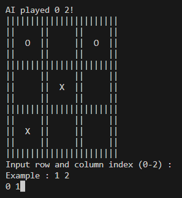
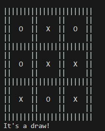

# Tic-Tac-Toe-Ca-GaIB
Implementation of Minimax algorithm in Tic-Tac-Toe game bot.

## Table of Contents
* [Technologies Used](#technologies-used)
* [How to run](#how-to-run)
* [Screenshots](#gameplay-screenshots)

## Technologies Used
- python - version 3.10
- numpy - version 1.21.6

## How to run
Use this command in the root directory of the repository
```
python src/main.py
```
After running the program, you would be asked to play first or second. After answering that question, the game will be started.

## Gameplay Screenshots


